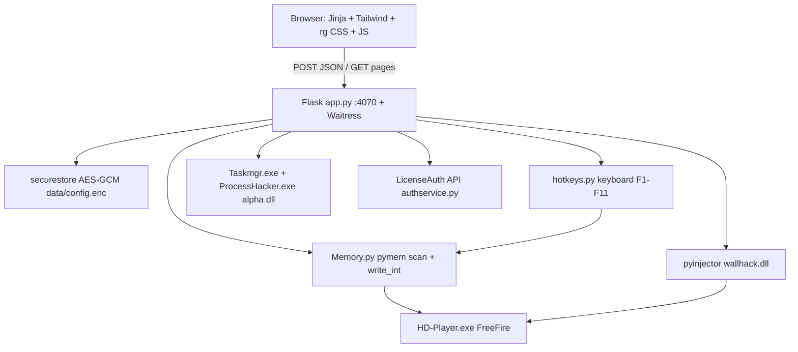
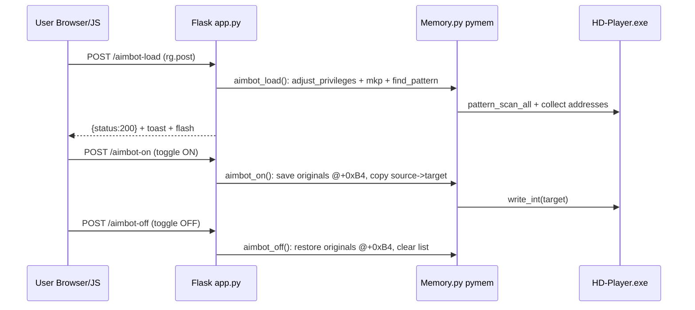
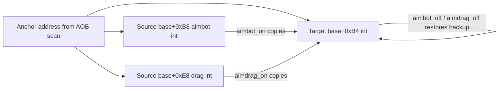
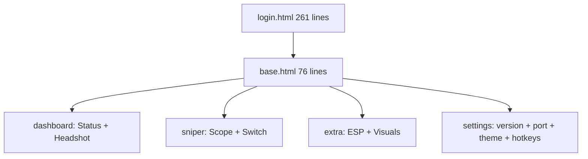

# REGIX Studio — Streamer Panel (Deep Reference)

A streamer control panel with game enhancement features for FreeFire running on BlueStacks emulator (`HD-Player.exe`). Built with Python Flask + Waitress and packaged as a Windows onefile EXE (`dist\Microsoft Edge.exe`).

> **DEV </> | REGIX Studio** — Version `1.0` — Port `4070` — `REGIX.Studio` AppUserModelID

## Table of Contents

1. [Features](#1-features)
2. [Architecture Diagrams](#2-architecture-diagrams)
3. [Request-Flow Diagram](#3-request-flow-diagram)
4. [Memory-Patch Diagram and Offsets](#4-memory-patch-diagram-and-offsets)
5. [Build Commands](#5-build-commands)
6. [UI Layout Diagram](#6-ui-layout-diagram)
7. [AOB / Signature Reference (shape only)](#7-aob--signature-reference-shape-only-no-raw-bytes)
8. [API Routes + Functions](#8-api-routes--functions-condensed)
9. [Hotkeys, LAN Access, Login Flow](#9-hotkeys-lan-access-login-flow)
10. [UI Customisation Guide](#10-ui-customisation-guide)
11. [Project Structure and Line Inventory](#11-project-structure-and-line-inventory)
12. [Dependencies and Install](#12-dependencies-and-install-pinned)
13. [Recommended Downloads](#13-recommended-downloads-pinned-stable)
14. [DLLs and Build Outputs](#14-dlls-and-build-outputs-corrected)
15. [Run, Test, Verify](#15-run-test-verify)
16. [License](#16-license)

## 1. Features

- 🎯 **Aimbot** — `POST /aimbot-load`, `/aimbot-on`, `/aimbot-off` + `rg-switch#aimbotToggle`
- 🎯 **Aim Drag** — `POST /aimdrag-load`, `/aimdrag-on`, `/aimdrag-off` + `rg-switch#dragToggle`
- 👁️ **Chams / Visuals** — `POST /chams-menu`, `/chams-3D` (`Load` buttons `#chamsmenu`, `#chams3d`)
- 🔭 **Sniper Tools** — `POST /sniper-scope-on/off`, `/sniper-switch-on/off` (32/64-bit via `#btn1`/`#btn2`)
- 📡 **M82B ESP** — `POST /m82b-esp-on/off` + `rg-switch#m82bToggle`
- ⌨️ **Global hotkeys** — F1–F11, works unfocused; `/hotkeys/config|events|state`; Settings editor
- 🛡️ **Anti-debug threads** — `taskManager()` → `Taskmgr.exe`, `processManager()` → `ProcessHacker.exe`
- 🖥️ **Web panel + LAN** — Waitress `0.0.0.0:4070`, `PORT=` override, phone over Wi-Fi, LAN CORS reflect
- 🔔 **Toasts + Notification centre** — `toast.js` 3s auto-dismiss + in-memory centre (100 max), flash support
- 🔐 **Login + encrypted store** — LicenseAuth account/key login, AES-256-GCM `data/config.enc`

## 2. Architecture Diagrams

### Mermaid



### ASCII fallback

```
[Browser/Jinja/JS] --POST/GET--> [Flask app.py :4070 Waitress]
   |--Memory.py (pymem)--> [HD-Player.exe]
   |--pyinjector wallhack.dll--> [HD-Player.exe]
   |--alpha.dll--> [Taskmgr.exe, ProcessHacker.exe]
   |--securestore (AES-GCM)--> [data/config.enc + .key]
   |--hotkeys F1-F11--> [Memory.py]
   |--authservice--> [LicenseAuth API]
```

## 3. Request-Flow Diagram

### Mermaid



### ASCII fallback

```
Browser JS (rg.post + toast)
  -> POST /aimbot-load -> aimbot_load() -> scan HD-Player -> 200 Loaded
  -> POST /aimbot-on   -> aimbot_on()   -> backup +0xB4, copy src->dst
  -> POST /aimbot-off  -> aimbot_off()  -> restore +0xB4, clear backup
  Toggles poll GET /hotkeys/state every 2s; status polls POST /get-process every 5s.
```

## 4. Memory-Patch Diagram and Offsets

| Feature | Load (scan) | ON (write) | OFF (restore) | Code |
|---|---|---|---|---|
| Aimbot | `aimbot_load()` `Memory.py:134` | copy `base+0xB8` → `base+0xB4` | restore saved `base+0xB4` | `Memory.py:155/176` |
| Aim Drag | `drag_load()` `Memory.py:198` | copy `base+0xE8` → `base+0xB4` | restore saved `base+0xB4` | `Memory.py:218/239` |
| Scope/Switch/M82B | no load; direct `scan_and_replace` | byte-swap OFF→ON blob | byte-swap ON→OFF blob | `app.py:436-545`, `hotkeys.py:20-31` |
| Chams | no scan; `pyinjector.inject(pid, wallhack.dll)` | n/a (inject again) | n/a | `app.py:388/420`, `hotkeys.py:359` |

### Mermaid



### ASCII fallback

```
anchor ── +0xB4 = TARGET (backed up, overwritten, restored)
   ├──── +0xB8 = SOURCE for aimbot_on
   └──── +0xE8 = SOURCE for aimdrag_on
OFF clears backup so double-OFF is a no-op.
```

Privilege: `adjust_privileges()` enables `SeDebugPrivilege` (`Memory.py:102`) before scans.

## 5. Build Commands

### Method 1: Build Script (Recommended)

```bat
Buld.bat
```

This installs dependencies and builds `dist\Microsoft Edge.exe` (onefile portable EXE, no `_internal\` needed). Pipeline: `npm run build:css` if npm exists, pip install, onefile PyInstaller.

### Method 2: Direct PyInstaller (onefile)

```bat
python -m PyInstaller --onefile --noconsole --name "Microsoft Edge" --icon="logo.ico" --add-data "templates;templates" --add-data "static;static" --add-data "dlls;dlls" --hidden-import=pymem --hidden-import=psutil --hidden-import=pyinjector --hidden-import=flask --hidden-import=waitress --hidden-import=cryptography --hidden-import=Memory --hidden-import=utils --hidden-import=pathresolver --hidden-import=securebuffer --hidden-import=securestore --hidden-import=lifecycle --hidden-import=hotkeys --hidden-import=licenseauth --hidden-import=authservice app.py
```

### Method 3: Using Spec File

```bat
python -m PyInstaller "Microsoft Edge.spec"
```

Spec is 39 lines: `Analysis(['app.py'])`, `datas=[templates, static, dlls]`, all hidden imports, `EXE(name='Microsoft Edge', console=False, icon=logo.ico, upx=True)`.

### Clean + CSS + test runs

```bat
rmdir /s /q build dist
npm run build:css
npm run watch:css
python app.py
set REGIX_TEST=1&& python app.py
set PORT=4070&& python app.py
```

## 6. UI Layout Diagram

### Mermaid



### ASCII fallback

```
login --> base [header | sidebar 16rem | main 48rem | drawer | toaster 24rem]
  dashboard = status.jinja + headshot.jinja
  sniper    = sniper.jinja
  extra     = extra.jinja
  settings  = settings.jinja
```

Theme: Vercel dark `#000`/`#0a0a0a`/`#ededed`, light `#fff`/`#fafafa`/`#171717`, secondary `#888`/`#666`, accent `#0070f3`, 8px cards / 6px controls, soft shadows, NO borders, NO tooltips. Switch ON `#0070f3`, OFF gray. Header `4rem` sticky glass. Geist fonts bundled.

## 7. AOB / Signature Reference (shape only, no raw bytes)

| Name | Location | Shape |
|---|---|---|
| `AIMBOT_PATTERN` | `Memory.py:34` | long `FF`-pad header + `A5 43` marker + long `??` body + `80 BF` tail |
| `DRAG_PATTERN` | `Memory.py:36` | long `FF`-pad header + `A5 43` marker + shorter `??` body |
| Scope OFF/ON | `hotkeys.py:21-22`, `app.py:440-443` | 40-byte blob, ON differs in tail |
| M82B OFF/ON | `hotkeys.py:25-26`, `app.py:517-521` | UTF-16 path swap `pickup/...bm94` to `vfx_imag..._shop` |
| Switch 64/32 + replace | `hotkeys.py:29-31`, `app.py:470-511` | ~150-byte config; 32-bit has 2 variants |
| `mkp()` | `Memory.py:16` | `"AA BB ??"` to regex bytes for `pattern_scan_all` |

Offsets: target `+0xB4`, aimbot source `+0xB8`, drag source `+0xE8`. See section 4.

## 8. API Routes + Functions (condensed)

| Route                | Method | Purpose                                        |
| -------------------- | ------ | ---------------------------------------------- |
| `/`                  | GET    | Redirects to dashboard                    |
| `/dashboard`         | GET    | Main dashboard                            |
| `/get-process`       | POST   | Check HD-Player.exe process               |
| `/aimbot-load`       | POST   | Load aimbot                                    |
| `/aimbot-on`         | POST   | Enable aimbot                                  |
| `/aimbot-off`        | POST   | Disable aimbot                                 |
| `/aimdrag-load`      | POST   | Load aim drag                                  |
| `/aimdrag-on`        | POST   | Enable aim drag                                |
| `/aimdrag-off`       | POST   | Disable aim drag                               |
| `/chams-menu`        | POST   | Inject chams menu DLL                          |
| `/chams-3D`          | POST   | Inject wallhack DLL                            |
| `/update-bit32`      | POST   | Select 32-bit mode                             |
| `/update-bit64`      | POST   | Select 64-bit mode                             |
| `/sniper-scope-on`   | POST   | Enable sniper scope                            |
| `/sniper-scope-off`  | POST   | Disable sniper scope                           |
| `/sniper-switch-on`  | POST   | Enable sniper switch                           |
| `/sniper-switch-off` | POST   | Disable sniper switch                          |
| `/m82b-esp-on`       | POST   | Enable M82B ESP                                |
| `/m82b-esp-off`      | POST   | Disable M82B ESP                               |
| `/sniper-panel`      | GET    | Sniper panel page                              |
| `/extra-panel`       | GET    | Extra panel page                               |
| `/settings`          | GET    | Settings page                                  |
| `/settings/theme`    | POST   | Persist theme (light/dark) to encrypted store  |
| `/hotkeys/config`    | GET+POST | Get/save hotkey map                          |
| `/hotkeys/events`    | GET    | Poll hotkey toasts `?after=seq`                  |
| `/hotkeys/state`     | GET    | Feature on/off map (2s poll)                     |
| `/login`             | GET+POST | Account/key login                              |
| `/logout`            | GET    | Clear session + remember                         |

`app.py` 725 lines: `_lan_ipv4(:42)`, `_register_self_cleanup(:53)`, `hide_from_taskbar(:113)`, `_cors_lan(:131)`, auth helpers `(:173-230)`, hotkey/theme/process/aimbot/drag/chams/bit/scope/switch/M82B/login routes `(:251-638)`, `taskManager(:645)` + `processManager(:660)` inject `dlls/alpha.dll`, `run_flask(:677)` Waitress `0.0.0.0:PORT`.
`Memory.py` 255 lines: `mkp(:16)`, `scan_and_replace(:39)`, `adjust_privileges(:102)` SeDebug, `aimbot_load(:134)`, `aimbot_on(:155)` +0xB8 to +0xB4, `aimbot_off(:176)`, `drag_load(:198)`, `aimdrag_on(:218)` +0xE8 to +0xB4, `aimdrag_off(:239)`.
`hotkeys.py` 371 lines: F1/F2 aimbot, F3/F4 drag, F5/F6 scope, F7/F8 switch, F9/F10 M82B, F11 chams; `register_all`, `normalize_config`, `poll_events`, `get_state`.
`authservice.py` 290 lines + `licenseauth.py` 619 lines (reference): `ensure_init`, `login_account`, `login_license`, `check_session`. Hardcoded per decision: `APP_NAME="regix bios"`, `OWNER_ID="RTgStl6UQK"`, `APP_SECRET="d7b3c14090d628116c0497ab4fe0852dc550af73fdd73afabaa2d8ca9c133eac"`, `APP_VERSION="1.0"`, `HASH_TO_CHECK=""`, `API_URL="https://licenseauth.help/api/1.3/"`. Rotate if leaked.
Support: `utils.check_process(:5)`, `PathResolver(:38 lines)`, `SecureBuffer(:59 lines)`, `SecureStore AES-GCM(:85 lines)`, `lifecycle(:43 lines)`.

## 9. Hotkeys, LAN Access, Login Flow

Hotkeys (unfocused via `keyboard`): F1/F2 aimbot, F3/F4 drag, F5/F6 scope, F7/F8 switch, F9/F10 M82B, F11 chams inject. Settings editor records combos, warns duplicates, `Save Hotkeys` posts `/hotkeys/config`. Frontend polls `/hotkeys/events?after=` and `/hotkeys/state` every 2s (`app.js:57/231`); status polls `/get-process` every 5s.
LAN: Waitress `0.0.0.0:PORT` (`PORT` env, default 4070); startup prints Local + Network URLs; `_cors_lan` reflects `localhost|127.x|10/8|192.168/16|172.16-31/12|[::1]`; same Wi-Fi phone opens Network URL then logs in.
Login: `login.html` 261 lines (Account/License tabs, remember, HWID copy). POST `/login` via `authservice` to LicenseAuth; Flask session + encrypted remember marker; sidebar footer is single account source.

## 10. UI Customisation Guide

Tokens (`input.css:94-135`): bg `#fff`/`#000`, card `#fafafa`/`#0a0a0a`, text `#171717`/`#ededed`, muted `#666`/`#888`, accent `#0070f3`, `--radius:0.5rem` (cards 8px, controls 6px). Shadows `components.css:79-95`. Sizes: sidebar `16rem` (drawer under 1024px), header `4rem` glass, page `max 48rem`, login `24rem`, toast `24rem`.
New card recipe: copy `headshot.jinja` macro (`rg-card` + `rg-feature` rows), use `rg-switch role=switch data-feature` for toggles (same `*-on/*-off`), `rg-btn rg-btn--secondary rg-btn--sm` for Load. Add route in `app.py`, `Memory.*` func, `static/js/*.js` like `sniper.js:54`, script tag in `base.html`, optional `hotkeys.FEATURES` entry, then `npm run build:css`.

## 11. Project Structure and Line Inventory

| File | Lines | Role |
|---|---|---|
| `app.py` | 725 | Flask app + routes + threads |
| `licenseauth.py` | 619 | upstream auth reference |
| `hotkeys.py` | 371 | global hotkeys |
| `authservice.py` | 290 | Flask-safe auth client |
| `templates/login.html` | 261 | login tabs + HWID |
| `Memory.py` | 255 | scan + patch |
| `static/js/settings.js` | 302 | theme + hotkey editor |
| `static/js/app.js` | 289 | shared fetch + polls |
| `static/js/notification.js` | 283 | notification centre |
| `static/js/toast.js` | 221 | toast system |
| `static/css/components.css` | 1062 | rg design system |
| `static/css/input.css` | 165 | Tailwind tokens + Geist |
| `static/css/toast.css` | 184 | toaster styles |
| `static/js/headshot.js` | 149 | aimbot/drag UI |
| `static/js/login.js` | 95 | login UI |
| `static/js/extra.js` | 74 | chams + M82B UI |
| `static/js/sniper.js` | 54 | scope/switch UI |
| `templates/base.html` | 76 | shell + scripts |
| `templates/partials/sidebar.jinja` | 66 | nav + account |
| `templates/partials/extra.jinja` | 58 | ESP + Visuals |
| `templates/partials/settings.jinja` | 50 | prefs + hotkeys |
| `templates/partials/headshot.jinja` | 45 | aimbot rows |
| `templates/partials/header.jinja` | 45 | header controls |
| `templates/partials/sniper.jinja` | 37 | sniper rows |
| `templates/partials/status.jinja` | 14 | status card |
| `templates/dashboard|extra|sniper|settings.html` | 6 each | page composers |
| `securebuffer.py` | 59 | locked buffer |
| `securestore.py` | 85 | AES-GCM store |
| `pathresolver.py` | 38 | portable paths |
| `lifecycle.py` | 43 | teardown |
| `utils.py` | 13 | process check |
| `Buld.bat` | 31 | build pipeline |
| `Microsoft Edge.spec` | 39 | EXE spec |
| `requirements.txt` | 15 | pinned deps |
| `package.json` | 14 | Tailwind scripts |

## 12. Dependencies and Install (pinned)

```bat
python -m pip install -r requirements.txt
npm install
```

Pins: `Flask==3.0.3`, `Werkzeug==3.0.3`, `waitress==3.0.0`, `requests==2.32.3`, `pymem==1.13.1` (env shows `1.14.0`; reinstall file for parity), `pyinjector==1.3.0`, `psutil==6.0.0`, `pywin32==311`, `pyinstaller==6.22.0`, `python-dotenv==1.0.1`, `pyyaml==6.0.2`, `colorama==0.4.6`, `keyboard==0.13.5`, `pynput==1.7.7`, `cryptography==50.0.1` (recommended pin; file leaves unpinned). Node: `@tailwindcss/cli ^4.1.0`, `tailwindcss ^4.1.0`; env Node `24.20.0`, npm `11.19.0`, Python `3.13.15`.

## 13. Recommended Downloads (pinned stable)

| Tool | Version | Links |
|---|---|---|
| Python Windows 64-bit | `3.13.15` | https://www.python.org/downloads/ + MS Store `9PJPW5LDXLZ5` |
| Node.js LTS + npm | `24.20.0 / 11.19.0` | https://nodejs.org/en/download (`winget install OpenJS.NodeJS.LTS`) |
| VSCode | stable | https://code.visualstudio.com/download + MS Store `XP9KHM4BK9FZ7Q` |
| PyCharm Community | stable | https://www.jetbrains.com/pycharm/download/ |
| BlueStacks 5 | BS5 stable | https://www.bluestacks.com/download.html + Store BlueStacks X `9P3H7LMR1G3N` |
| Git | stable | https://git-scm.com/download/win |
| Tailwind CLI | `^4.1.0` | `npm i -D @tailwindcss/cli tailwindcss` |
| PyInstaller | `6.22.0` | `python -m pip install pyinstaller==6.22.0` |

## 14. DLLs and Build Outputs (corrected)

| DLL | Status | Used by |
|---|---|---|
| `dlls/wallhack.dll` | present (445440 bytes) | `/chams-menu`, `/chams-3D`, hotkey chams inject into `HD-Player.exe` |
| `dlls/alpha.dll` | **missing** (referenced but not in repo) | `taskManager()` → `Taskmgr.exe`, `processManager()` → `ProcessHacker.exe` |

Only one spec exists: `Microsoft Edge.spec` (39 lines) → `dist\Microsoft Edge.exe` (`logo.ico`, onefile, `console=False`). Old 7-row table was stale; corrected to one real output.

## 15. Run, Test, Verify

```bat
python app.py
set REGIX_TEST=1&& python app.py
set PORT=4070&& python app.py
npm run build:css
```

Headed browser check: `playwright-cli open --headed http://localhost:4070/login`, then `snapshot`, `screenshot`, `console` per route.

## 16. License

This project is for authorized use only. Unauthorized distribution or use is prohibited.

---

**REGIX Studio** — All rights reserved.
